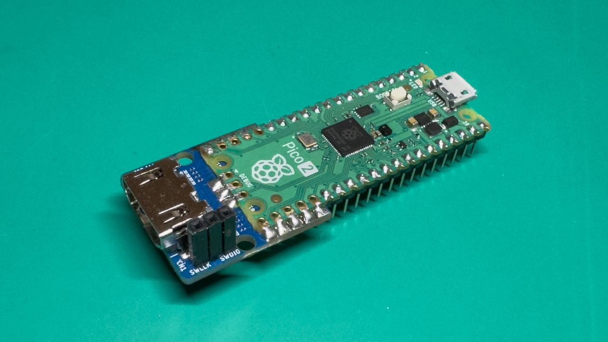

# PicoRabbit

PicoRabbit is an experimental project to implement a presentation tool like [Rabbit](https://rabbit-shocker.org/en/) on Raspberry Pi Pico 2.

## Features

- [x] DVI output using HSTX
- [x] Buffering
- [x] Text rendering
- [ ] Paging/Transition
- [x] mruby integration
- [ ] PicoRuby integration
- [ ] USB MSC support

## Hardware Requirements

The project requires a Raspberry Pi Pico 2 or other hardware with the RP2350 chip to output DVI using the HSTX interface. For video output, you need a digital video connector with current-limiting resistors connected to GPIOs 12-19. It matches the [Pico DVI Sock](https://github.com/Wren6991/Pico-DVI-Sock) design.



Ready-to-use boards are available from:

- Switch Science: [DVI Adapter Board for Raspberry Pi Pico](https://www.switch-science.com/products/7431) (Japan)
- Adafruit: [Adafruit DVI Sock for Pico](https://www.adafruit.com/product/5957) (US & International)

## Pin Configuration

- GPIO 12: D0+
- GPIO 13: D0-
- GPIO 14: CK+
- GPIO 15: CK-
- GPIO 16: D2+
- GPIO 17: D2-
- GPIO 18: D1+
- GPIO 19: D1-

## Build Instructions

I highly recommend using the official [Raspberry Pi Pico Extension for Visual Studio Code](https://marketplace.visualstudio.com/items?itemName=raspberry-pi.raspberry-pi-pico) to development and debugging. See [Getting Started guide](https://datasheets.raspberrypi.com/pico/getting-started-with-pico.pdf).

```bash
mkdir build
cd build
export PICO_SDK_PATH=/path/to/pico-sdk
cmake ..
make
```

## License

See [LICENSE.md](./LICENSE.md).
